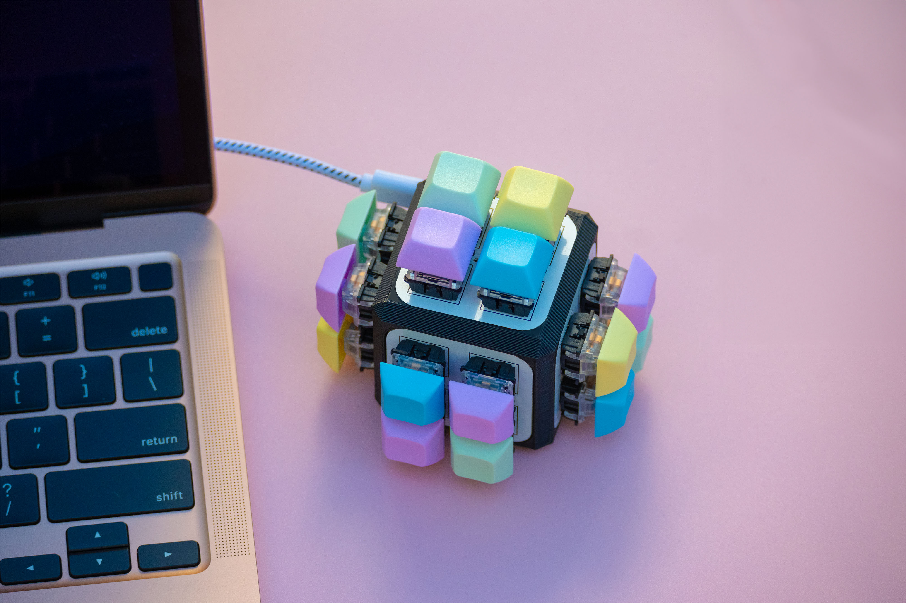

# ZM Keyboard Cube 16 Key

A 16 key keyboard Cube with 1 Mainboard and 4 Sisterboards (4 Keys Each) in a 3D Printed Base.

  

## Mainboard

The mainboard is the central board that connects to the computer via USB. It has the microcontroller and the USB connection.

## Sisterboards

The sisterboards connect to the mainboard via PH2 5p ribbon cables.

## Base

The base is the 3D printed part that holds the sisterboards in place.

- (x1) Atmega32U4 (Pro Micro) (USB-C) - [Link](https://www.amazon.com/Teyleten-Robot-Atmega32U4-Development-Microcontroller/dp/B0B6HYLC44/ref=sr_1_3?crid=1Z72IVD6K5QHB&dib=eyJ2IjoiMSJ9.ZidoVDxKehMzRyb3OnIOUo7kCMI-GTvSp8v7tkyBgL58BA7p-ziPMY3oMDgqOEOSc-QSt5b9E2ShBIV1P1GqltFQyeQdjE1EkB5qMozeYW51NsABdqJFCIgT2WEEWY_R9xddxr3srWrZVNAf-xJ2JPbD7jBVTHMw4OqssJZYym9T-Zi5mb3ce8zx-ZsavVqMM9MerjAdKGGWrFRPn9edUzxeo9KCNIvvgTs9WT3TAQY.qMJEUBNzrmVkAFhxaOTXeT6QcE5j--6zlO3GW4qDL_c&dib_tag=se&keywords=pro+micro+usb&qid=1729896778&sprefix=pro+micro+usbc%2Caps%2C93&sr=8-3)

- (x8) PH2.0 5P Connectors - Male - [Link](https://www.amazon.com/Socket-Compatible-JST-PH-Connectors-Through-Hole/dp/B0BM4B7Q1K/ref=sr_1_2?crid=LV04WY779AOP&dib=eyJ2IjoiMSJ9.J0JspjfmU_wA5IvcpMg1OEPEzAe5_aWIRqTMSLZ75sD55DVV8BfTNjyL37ELqL9Yo3JJcSmmmZBcYGHI5VTjTo5TfPZqyB15otkQ48M3bAa6nwT3vhhFxpPeoMUQpHM1Kd-L1LPQee2uXjqVZIUMOLCl5viVLokYCIk3Sx3uOkWf3mIvBt6Y70WREVtoE0QPzGMzJpf5dsGhapXAKQPqOaQVjBZMQytHxUTCKvVDxZ4sDxV_-U8NpOfPLmfVt1WSLR0s8ArhS5NIyv0uWAYu-UMxuhsJzhWZVWSuTZMwIjs.5gs8FlujRHL-QlnwpdgZjsAxdbtPww1E7dCm-rb5q_A&dib_tag=se&keywords=PH2.0+5p&qid=1729896495&sprefix=ph2.0+5p%2Caps%2C85&sr=8-2)

- (x4) PH2.0 5P Cable - Female-Female - [Link](https://www.amazon.com/Yoeruyo-PH2-0mm-Connector-Pre-Crimped-4Pin-20CM/dp/B0C2HF8TBS/ref=sr_1_1_sspa?crid=XRZ4U9WQEIVQ&dib=eyJ2IjoiMSJ9.FKkY4Jt_t46mCYFx8ArLnsIfCDSDHx2Az_dhmAAi9Rq1faGdE11rb3osOfSfDVOaYsH3tv-8nA57dITboaWRrjXOTBXHDgOPbTFpI5xBegpQJiBMcPaXNc_DAU5hD9bfAa4EQWu2SNWp5kH9JA8PoZ4j7y0KE8FlXSnOtHaH0YtGUg-8KtPJAcjzQ7YCVczTQhrCBs9d3qKLWnFpZLFJ6A4hU8sezLmPwESGjEYNS5U.O7sbp3c5--FCIYe7EeUYRELl1z3DWdIYN1yBCFfXQK4&dib_tag=se&keywords=PH2.0%2B5p%2Bcable&qid=1729896566&sprefix=ph2.0%2B5p%2Bcabl%2Caps%2C76&sr=8-1-spons&sp_csd=d2lkZ2V0TmFtZT1zcF9hdGY&th=1)

- (x16) Hotswap Sockets - [Link](https://www.amazon.com/Hot-swap-CPG151101S11-Mechanical-Keyboard-Accessories/dp/B0BVH6M5FP/ref=sr_1_1?crid=1EOEB4ONKKFD5&dib=eyJ2IjoiMSJ9.4jfJMBrnUtVfrD9ndIz5DRPr_csC9M51qPB37z6UI-epkawz0rnq5i67-g2K4mT6iEJaaur9fJryHN7to2gaqUehXHSz2zR0-QSdZg82fCvdf7W9HlWMAyIL1mIesauSiZEzowsU7TEAikLdYLcxYbAIz0h6mlMZBr5-VICxtsn7FZY5GvxP0sg4nF6mmTHFQMUKvx8nfnaEn9tJ8tlXGIHY8yAivTQxTYzsQhptEGM.kBMaLn_dUZwebYqNC1GzRutIyU5VafRdvxoE34a5O9w&dib_tag=se&keywords=Kailh+hotswap&qid=1729908615&sprefix=kailh+hotswap%2Caps%2C82&sr=8-1)

- (x16) Any MX Style Switches - [Outemu Blue Switches](https://www.amazon.com/Mechanical-Switches-Keyboard-Replacement-Included/dp/B09NNMFHQY/ref=sr_1_1_sspa?crid=38YLXTN2CSOJP&dib=eyJ2IjoiMSJ9._hEHWPLGZrlEGSrl9SWBvSyEZqltBi7qKImq_mFL_8glX6MrHuVNWap5utrZ3Bh_YxgNpYrd15wMgBtklIa47GeoHaP6QM5wPxosRUpmXzAGr4dPMh45LHF-ui9pG0co_ntdtFRaYkb7QVmdPCYj_zvMLUM_Tjk3Ve2o8r5veZguIq7zxh1OTzlqYxTlHZALmrnIv9nsqO6fvG1qXvvSLd_icYLjV2Oo4swkAmwuNns.dBM0RIgAmaiUtjpF8hNgDO55DeabKdxSG35fwxZnoUg&dib_tag=se&keywords=blue+switches&qid=1729908712&sprefix=blue+switche%2Caps%2C87&sr=8-1-spons&sp_csd=d2lkZ2V0TmFtZT1zcF9hdGY&psc=1)

- (x1) Mainboard PCB
- (x4) Sisterboard PCB
